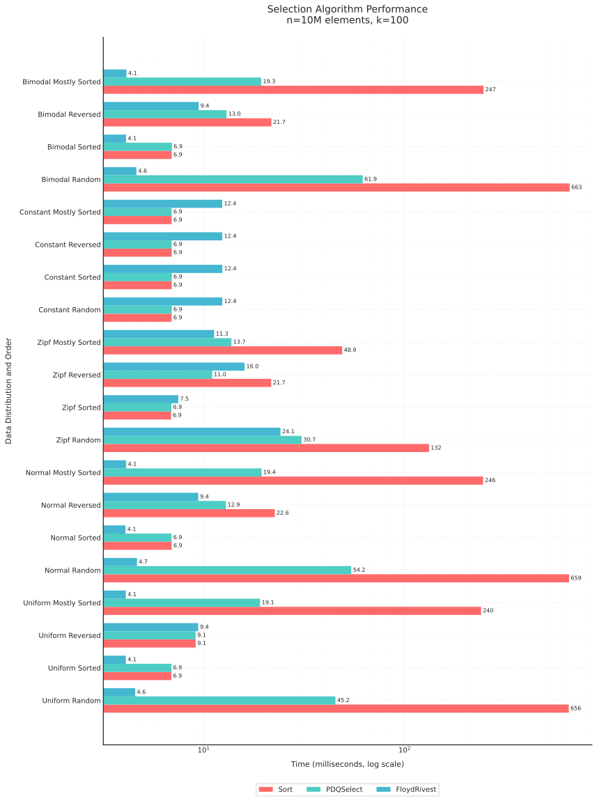

# kth: High-Performance Selection Algorithms for Go

[](https://pkg.go.dev/github.com/tsenart/pdqselect)
[](https://goreportcard.com/report/github.com/tsenart/pdqselect)
[](LICENSE)

`kth` provides high-performance selection algorithms that find the k-th smallest element without sorting the entire dataset. It's especially useful for operations like finding top-N elements or medians in large datasets.

## Features

- **Algorithms for Different Needs**:
  - FloydRivest: Fastest for random data distributions
  - PDQSelect: Most consistent across all data patterns
- **Speed**: Both significantly outperform sort-based selection, with up to 99% improvement in common cases
- **Memory Efficient**: All operations are in-place, requiring no additional memory
- **Production Ready**: Battle-tested and fuzzed implementations that work with any ordered type


## Installation

```bash
go get github.com/tsenart/kth
```

## Usage

The library provides three ways to use each algorithm, depending on your data type:

```go
// 1. For types implementing sort.Interface
func PDQSelect(data sort.Interface, k int)
func FloydRivest(data sort.Interface, k int)

// 2. For slices of ordered types
func PDQSelectOrdered[T cmp.Ordered](data []T, k int)
func FloydRivestOrdered[T cmp.Ordered](data []T, k int)

// 3. For custom comparison functions
func PDQSelectFunc[E any](data []E, k int, less func(a, b E) bool)
func FloydRivestFunc[E any](data []E, k int, less func(a, b E) bool)
```

### Examples

1. Using with `sort.Interface`:
```go
type Ints []int

func (x Ints) Len() int           { return len(x) }
func (x Ints) Less(i, j int) bool { return x[i] < x[j] }
func (x Ints) Swap(i, j int)      { x[i], x[j] = x[j], x[i] }

data := Ints{7, 4, 9, 1, 3, 8, 2, 6, 5}
FloydRivest(data, 3) // Find 3rd smallest
// data is now partitioned with the 3rd element (3) in position
// [1 2 3 | 7 4 9 8 6 5]  (elements around 3 may not be sorted)
```

2. Using with `cmp.Ordered` types:
```go
scores := []float64{89.7, 95.3, 78.4, 92.1, 88.9}
PDQSelectOrdered(scores, len(scores)/2) // Find median
// scores now has median at middle position
```

3. Using with custom comparison:
```go
type User struct {
    Name string
    Age  int
}

users := []User{
    {"Alice", 25},
    {"Bob", 30},
    {"Charlie", 20},
}

// Find youngest 2 users
PDQSelectFunc(users, 2, func(a, b User) bool {
    return a.Age < b.Age
})
```

## Benchmarks



### Select your Selection Algorithm

| When to use FloydRivest | When to use PDQSelect |
|-------------------------|----------------------|
| Random or mixed data | Data with all equal values |
| Mostly sorted data | Reverse sorted data |
| When maximum speed is needed | When consistent performance is needed |

#### Floyd-Rivest Selection (FloydRivest)

The benchmarks show FloydRivest is extremely fast, typically taking 4-6ms for 10 million elements. While it performs 70-80% slower than PDQSelect on data with all equal values, it's still fast in absolute terms (12ms vs 7ms for 10M elements).

Key characteristics:
- Fastest on random, mixed data (4ms vs 650ms for sorting)
- Excellent on mostly sorted data (4ms vs 240ms for sorting)
- Still reasonably fast (12ms) even in its worst case with equal values

#### Pattern-Defeating Quickselect (PDQSelect)

PDQSelect shows more consistent performance across all data patterns, typically taking 6-7ms for 10 million elements:

Key characteristics:
- Consistent 6-7ms performance across different patterns
- Better handling of data where all values are equal (7ms vs 12ms)
- Good performance on reverse sorted data
- Never significantly worse than sorting
- More predictable performance bounds

```
goos: darwin
goarch: arm64
pkg: github.com/tsenart/kth
cpu: Apple M3 Max
                                                                 │ PDQSortOrdered │           PDQSelectOrdered           │       FloydRivestSelectOrdered       │
                                                                 │     sec/op     │    sec/op     vs base                │    sec/op     vs base                │
Select/n=10000000/k=1/dist=uniform/order=random-16                  659.651m ± 0%    6.817m ± 1%  -98.97% (p=0.000 n=15)    4.145m ± 1%  -99.37% (p=0.000 n=15)
Select/n=10000000/k=1/dist=uniform/order=sorted-16                    6.928m ± 1%    6.757m ± 0%   -2.47% (p=0.000 n=15)    4.119m ± 0%  -40.54% (p=0.000 n=15)
Select/n=10000000/k=1/dist=uniform/order=reversed-16                  9.155m ± 1%    6.851m ± 1%  -25.17% (p=0.000 n=15)    9.440m ± 1%   +3.12% (p=0.000 n=15)
Select/n=10000000/k=1/dist=uniform/order=mostly_sorted-16           241.363m ± 0%    6.875m ± 2%  -97.15% (p=0.000 n=15)    4.123m ± 0%  -98.29% (p=0.000 n=15)
Select/n=10000000/k=1/dist=uniform/order=push_front-16               14.211m ± 0%    6.887m ± 1%  -51.54% (p=0.000 n=15)    4.131m ± 1%  -70.93% (p=0.000 n=15)
Select/n=10000000/k=1/dist=uniform/order=push_middle-16              10.610m ± 1%    6.892m ± 0%  -35.04% (p=0.000 n=15)    4.123m ± 0%  -61.14% (p=0.000 n=15)
Select/n=10000000/k=1/dist=normal/order=random-16                   659.398m ± 0%    6.766m ± 1%  -98.97% (p=0.000 n=15)    4.208m ± 0%  -99.36% (p=0.000 n=15)
Select/n=10000000/k=1/dist=normal/order=sorted-16                     7.095m ± 1%    6.854m ± 1%   -3.39% (p=0.000 n=15)    4.105m ± 2%  -42.15% (p=0.000 n=15)
Select/n=10000000/k=1/dist=normal/order=reversed-16                  22.861m ± 1%   25.139m ± 0%   +9.97% (p=0.000 n=15)    9.512m ± 1%  -58.39% (p=0.000 n=15)
Select/n=10000000/k=1/dist=normal/order=mostly_sorted-16            248.027m ± 1%    6.775m ± 2%  -97.27% (p=0.000 n=15)    4.108m ± 0%  -98.34% (p=0.000 n=15)
Select/n=10000000/k=1/dist=normal/order=push_front-16                14.022m ± 0%    6.753m ± 0%  -51.84% (p=0.000 n=15)    4.098m ± 0%  -70.77% (p=0.000 n=15)
Select/n=10000000/k=1/dist=normal/order=push_middle-16                8.897m ± 2%    6.318m ± 0%  -28.99% (p=0.000 n=15)    3.843m ± 1%  -56.80% (p=0.000 n=15)
Select/n=10000000/k=1/dist=zipf/order=random-16                     120.732m ± 1%    6.744m ± 3%  -94.41% (p=0.000 n=15)   23.277m ± 2%  -80.72% (p=0.000 n=15)
Select/n=10000000/k=1/dist=zipf/order=sorted-16                       6.950m ± 2%    6.782m ± 0%   -2.42% (p=0.000 n=15)    7.519m ± 1%   +8.18% (p=0.000 n=15)
Select/n=10000000/k=1/dist=zipf/order=reversed-16                    21.812m ± 0%    6.849m ± 0%  -68.60% (p=0.000 n=15)   15.954m ± 1%  -26.86% (p=0.000 n=15)
Select/n=10000000/k=1/dist=zipf/order=mostly_sorted-16               49.029m ± 0%    6.772m ± 1%  -86.19% (p=0.000 n=15)   11.284m ± 1%  -76.99% (p=0.000 n=15)
Select/n=10000000/k=1/dist=zipf/order=push_front-16                  10.007m ± 2%    6.766m ± 1%  -32.39% (p=0.000 n=15)    7.491m ± 1%  -25.14% (p=0.000 n=15)
Select/n=10000000/k=1/dist=zipf/order=push_middle-16                  9.195m ± 1%    6.747m ± 0%  -26.62% (p=0.000 n=15)    7.616m ± 1%  -17.17% (p=0.000 n=15)
Select/n=10000000/k=1/dist=constant/order=random-16                   7.216m ± 1%    6.822m ± 1%   -5.46% (p=0.000 n=15)   12.506m ± 2%  +73.32% (p=0.000 n=15)
Select/n=10000000/k=1/dist=constant/order=sorted-16                   6.993m ± 1%    6.812m ± 1%   -2.60% (p=0.000 n=15)   12.497m ± 0%  +78.69% (p=0.000 n=15)
Select/n=10000000/k=1/dist=constant/order=reversed-16                 6.968m ± 0%    6.790m ± 0%   -2.56% (p=0.000 n=15)   12.476m ± 1%  +79.05% (p=0.000 n=15)
Select/n=10000000/k=1/dist=constant/order=mostly_sorted-16            6.994m ± 1%    6.771m ± 2%   -3.19% (p=0.000 n=15)   12.499m ± 2%  +78.70% (p=0.000 n=15)
Select/n=10000000/k=1/dist=constant/order=push_front-16               6.981m ± 1%    6.750m ± 0%   -3.31% (p=0.000 n=15)   12.446m ± 0%  +78.27% (p=0.000 n=15)
Select/n=10000000/k=1/dist=constant/order=push_middle-16              6.931m ± 2%    6.751m ± 1%   -2.59% (p=0.000 n=15)   12.543m ± 1%  +80.97% (p=0.000 n=15)
Select/n=10000000/k=1/dist=bimodal/order=random-16                  650.814m ± 0%    6.835m ± 0%  -98.95% (p=0.000 n=15)    4.116m ± 1%  -99.37% (p=0.000 n=15)
Select/n=10000000/k=1/dist=bimodal/order=sorted-16                    7.036m ± 0%    6.813m ± 1%   -3.17% (p=0.003 n=15)    4.133m ± 0%  -41.26% (p=0.000 n=15)
Select/n=10000000/k=1/dist=bimodal/order=reversed-16                 21.472m ± 0%   25.146m ± 0%  +17.11% (p=0.000 n=15)    9.375m ± 0%  -56.34% (p=0.000 n=15)
Select/n=10000000/k=1/dist=bimodal/order=mostly_sorted-16           245.840m ± 0%    6.740m ± 0%  -97.26% (p=0.000 n=15)    4.089m ± 1%  -98.34% (p=0.000 n=15)
Select/n=10000000/k=1/dist=bimodal/order=push_front-16               13.970m ± 0%    6.749m ± 0%  -51.69% (p=0.000 n=15)    4.108m ± 0%  -70.60% (p=0.000 n=15)
Select/n=10000000/k=1/dist=bimodal/order=push_middle-16               9.349m ± 0%    6.755m ± 0%  -27.75% (p=0.000 n=15)    4.098m ± 0%  -56.17% (p=0.000 n=15)
Select/n=10000000/k=100/dist=uniform/order=random-16                656.304m ± 0%   45.236m ± 0%  -93.11% (p=0.000 n=15)    4.561m ± 1%  -99.31% (p=0.000 n=15)
Select/n=10000000/k=100/dist=uniform/order=sorted-16                  6.905m ± 0%    6.909m ± 1%        ~ (p=0.935 n=15)    4.098m ± 0%  -40.65% (p=0.000 n=15)
Select/n=10000000/k=100/dist=uniform/order=reversed-16                9.121m ± 0%    9.110m ± 0%        ~ (p=0.305 n=15)    9.389m ± 0%   +2.94% (p=0.000 n=15)
Select/n=10000000/k=100/dist=uniform/order=mostly_sorted-16         240.205m ± 0%   19.080m ± 0%  -92.06% (p=0.000 n=15)    4.097m ± 1%  -98.29% (p=0.000 n=15)
Select/n=10000000/k=100/dist=uniform/order=push_front-16             13.934m ± 0%   13.918m ± 0%        ~ (p=0.148 n=15)    4.095m ± 0%  -70.61% (p=0.000 n=15)
Select/n=10000000/k=100/dist=uniform/order=push_middle-16            10.439m ± 1%   10.392m ± 0%        ~ (p=0.217 n=15)    4.096m ± 0%  -60.76% (p=0.000 n=15)
Select/n=10000000/k=100/dist=normal/order=random-16                 658.613m ± 0%   54.247m ± 0%  -91.76% (p=0.000 n=15)    4.656m ± 0%  -99.29% (p=0.000 n=15)
Select/n=10000000/k=100/dist=normal/order=sorted-16                   6.929m ± 0%    6.917m ± 0%        ~ (p=0.325 n=15)    4.082m ± 0%  -41.09% (p=0.000 n=15)
Select/n=10000000/k=100/dist=normal/order=reversed-16                22.587m ± 0%   12.884m ± 0%  -42.96% (p=0.000 n=15)    9.396m ± 0%  -58.40% (p=0.000 n=15)
Select/n=10000000/k=100/dist=normal/order=mostly_sorted-16          245.850m ± 0%   19.411m ± 0%  -92.10% (p=0.000 n=15)    4.113m ± 0%  -98.33% (p=0.000 n=15)
Select/n=10000000/k=100/dist=normal/order=push_front-16              13.927m ± 0%   13.920m ± 0%        ~ (p=0.345 n=15)    4.091m ± 0%  -70.63% (p=0.000 n=15)
Select/n=10000000/k=100/dist=normal/order=push_middle-16              9.289m ± 0%    9.296m ± 0%        ~ (p=0.061 n=15)    4.068m ± 1%  -56.20% (p=0.000 n=15)
Select/n=10000000/k=100/dist=zipf/order=random-16                    132.35m ± 0%    30.71m ± 0%  -76.79% (p=0.000 n=15)    24.11m ± 0%  -81.78% (p=0.000 n=15)
Select/n=10000000/k=100/dist=zipf/order=sorted-16                     6.879m ± 0%    6.903m ± 0%   +0.35% (p=0.005 n=15)    7.478m ± 0%   +8.70% (p=0.000 n=15)
Select/n=10000000/k=100/dist=zipf/order=reversed-16                   21.67m ± 0%    11.02m ± 0%  -49.15% (p=0.000 n=15)    15.97m ± 0%  -26.29% (p=0.000 n=15)
Select/n=10000000/k=100/dist=zipf/order=mostly_sorted-16              48.88m ± 0%    13.74m ± 0%  -71.90% (p=0.000 n=15)    11.27m ± 0%  -76.94% (p=0.000 n=15)
Select/n=10000000/k=100/dist=zipf/order=push_front-16                 9.761m ± 1%    9.723m ± 1%        ~ (p=0.595 n=15)    7.475m ± 0%  -23.42% (p=0.000 n=15)
Select/n=10000000/k=100/dist=zipf/order=push_middle-16                9.098m ± 1%    9.091m ± 1%        ~ (p=0.806 n=15)    7.474m ± 0%  -17.85% (p=0.000 n=15)
Select/n=10000000/k=100/dist=constant/order=random-16                 6.924m ± 0%    6.931m ± 0%        ~ (p=0.512 n=15)   12.375m ± 0%  +78.73% (p=0.000 n=15)
Select/n=10000000/k=100/dist=constant/order=sorted-16                 6.932m ± 0%    6.934m ± 0%        ~ (p=0.935 n=15)   12.383m ± 0%  +78.65% (p=0.000 n=15)
Select/n=10000000/k=100/dist=constant/order=reversed-16               6.934m ± 0%    6.926m ± 0%        ~ (p=0.050 n=15)   12.376m ± 0%  +78.47% (p=0.000 n=15)
Select/n=10000000/k=100/dist=constant/order=mostly_sorted-16          6.927m ± 0%    6.925m ± 0%        ~ (p=0.967 n=15)   12.367m ± 0%  +78.54% (p=0.000 n=15)
Select/n=10000000/k=100/dist=constant/order=push_front-16             6.924m ± 0%    6.934m ± 0%        ~ (p=0.126 n=15)   12.375m ± 0%  +78.72% (p=0.000 n=15)
Select/n=10000000/k=100/dist=constant/order=push_middle-16            6.912m ± 0%    6.929m ± 0%        ~ (p=0.106 n=15)   12.386m ± 0%  +79.20% (p=0.000 n=15)
Select/n=10000000/k=100/dist=bimodal/order=random-16                663.006m ± 0%   61.886m ± 1%  -90.67% (p=0.000 n=15)    4.626m ± 1%  -99.30% (p=0.000 n=15)
Select/n=10000000/k=100/dist=bimodal/order=sorted-16                  6.931m ± 0%    6.949m ± 0%        ~ (p=0.161 n=15)    4.105m ± 1%  -40.78% (p=0.000 n=15)
Select/n=10000000/k=100/dist=bimodal/order=reversed-16               21.726m ± 0%   13.001m ± 0%  -40.16% (p=0.000 n=15)    9.441m ± 1%  -56.54% (p=0.000 n=15)
Select/n=10000000/k=100/dist=bimodal/order=mostly_sorted-16         247.029m ± 0%   19.339m ± 1%  -92.17% (p=0.000 n=15)    4.126m ± 2%  -98.33% (p=0.000 n=15)
Select/n=10000000/k=100/dist=bimodal/order=push_front-16             14.231m ± 1%   14.033m ± 1%   -1.39% (p=0.002 n=15)    4.120m ± 0%  -71.05% (p=0.000 n=15)
Select/n=10000000/k=100/dist=bimodal/order=push_middle-16             9.383m ± 2%    9.476m ± 1%        ~ (p=0.325 n=15)    4.129m ± 1%  -55.99% (p=0.000 n=15)
Select/n=10000000/k=5000000/dist=uniform/order=random-16             659.06m ± 1%    67.93m ± 0%  -89.69% (p=0.000 n=15)    34.63m ± 0%  -94.74% (p=0.000 n=15)
Select/n=10000000/k=5000000/dist=uniform/order=sorted-16              6.924m ± 0%    6.923m ± 0%        ~ (p=0.624 n=15)    5.130m ± 0%  -25.91% (p=0.000 n=15)
Select/n=10000000/k=5000000/dist=uniform/order=reversed-16            9.143m ± 0%    9.154m ± 0%        ~ (p=0.174 n=15)   11.192m ± 0%  +22.41% (p=0.000 n=15)
Select/n=10000000/k=5000000/dist=uniform/order=mostly_sorted-16      240.69m ± 0%    19.27m ± 0%  -91.99% (p=0.000 n=15)    11.60m ± 0%  -95.18% (p=0.000 n=15)
Select/n=10000000/k=5000000/dist=uniform/order=push_front-16         11.832m ± 0%   11.773m ± 0%   -0.50% (p=0.000 n=15)    8.056m ± 0%  -31.91% (p=0.000 n=15)
Select/n=10000000/k=5000000/dist=uniform/order=push_middle-16        10.471m ± 0%   10.467m ± 0%        ~ (p=0.345 n=15)    5.180m ± 1%  -50.53% (p=0.000 n=15)
Select/n=10000000/k=5000000/dist=normal/order=random-16              647.88m ± 0%    42.67m ± 0%  -93.41% (p=0.000 n=15)    34.56m ± 0%  -94.67% (p=0.000 n=15)
Select/n=10000000/k=5000000/dist=normal/order=sorted-16               6.940m ± 0%    6.919m ± 1%        ~ (p=0.106 n=15)    6.788m ± 0%   -2.18% (p=0.000 n=15)
Select/n=10000000/k=5000000/dist=normal/order=reversed-16             23.41m ± 0%    12.57m ± 0%  -46.30% (p=0.000 n=15)    12.58m ± 0%  -46.25% (p=0.000 n=15)
Select/n=10000000/k=5000000/dist=normal/order=mostly_sorted-16       245.94m ± 0%    19.31m ± 0%  -92.15% (p=0.000 n=15)    12.83m ± 0%  -94.78% (p=0.000 n=15)
Select/n=10000000/k=5000000/dist=normal/order=push_front-16          14.058m ± 0%   14.031m ± 0%   -0.19% (p=0.026 n=15)    5.398m ± 0%  -61.60% (p=0.000 n=15)
Select/n=10000000/k=5000000/dist=normal/order=push_middle-16          9.331m ± 0%    9.336m ± 0%        ~ (p=0.744 n=15)    5.213m ± 0%  -44.13% (p=0.000 n=15)
Select/n=10000000/k=5000000/dist=zipf/order=random-16                133.99m ± 0%    54.72m ± 0%  -59.16% (p=0.000 n=15)    40.84m ± 1%  -69.52% (p=0.000 n=15)
Select/n=10000000/k=5000000/dist=zipf/order=sorted-16                 6.929m ± 0%    6.923m ± 0%        ~ (p=0.461 n=15)    8.838m ± 0%  +27.55% (p=0.000 n=15)
Select/n=10000000/k=5000000/dist=zipf/order=reversed-16               21.92m ± 0%    11.56m ± 0%  -47.24% (p=0.000 n=15)    10.25m ± 0%  -53.25% (p=0.000 n=15)
Select/n=10000000/k=5000000/dist=zipf/order=mostly_sorted-16          48.89m ± 0%    18.57m ± 0%  -62.02% (p=0.000 n=15)    16.21m ± 0%  -66.84% (p=0.000 n=15)
Select/n=10000000/k=5000000/dist=zipf/order=push_front-16             9.691m ± 0%    9.677m ± 0%        ~ (p=0.325 n=15)    8.742m ± 0%   -9.79% (p=0.000 n=15)
Select/n=10000000/k=5000000/dist=zipf/order=push_middle-16            9.113m ± 0%    9.074m ± 0%   -0.43% (p=0.015 n=15)    8.739m ± 0%   -4.10% (p=0.000 n=15)
Select/n=10000000/k=5000000/dist=constant/order=random-16             6.926m ± 0%    6.967m ± 2%   +0.59% (p=0.001 n=15)   12.675m ± 0%  +83.00% (p=0.000 n=15)
Select/n=10000000/k=5000000/dist=constant/order=sorted-16             7.051m ± 2%    6.949m ± 1%        ~ (p=0.174 n=15)   12.602m ± 1%  +78.73% (p=0.000 n=15)
Select/n=10000000/k=5000000/dist=constant/order=reversed-16           7.112m ± 1%    7.134m ± 0%        ~ (p=0.389 n=15)   12.444m ± 0%  +74.98% (p=0.000 n=15)
Select/n=10000000/k=5000000/dist=constant/order=mostly_sorted-16      7.040m ± 2%    7.092m ± 0%   +0.74% (p=0.029 n=15)   12.781m ± 1%  +81.56% (p=0.000 n=15)
Select/n=10000000/k=5000000/dist=constant/order=push_front-16         7.111m ± 1%    7.061m ± 0%   -0.70% (p=0.011 n=15)   12.429m ± 2%  +74.78% (p=0.000 n=15)
Select/n=10000000/k=5000000/dist=constant/order=push_middle-16        6.976m ± 1%    7.002m ± 1%        ~ (p=0.902 n=15)   12.580m ± 1%  +80.33% (p=0.000 n=15)
Select/n=10000000/k=5000000/dist=bimodal/order=random-16             651.88m ± 0%    63.31m ± 0%  -90.29% (p=0.000 n=15)    34.74m ± 0%  -94.67% (p=0.000 n=15)
Select/n=10000000/k=5000000/dist=bimodal/order=sorted-16              7.048m ± 1%    7.043m ± 0%        ~ (p=0.744 n=15)    5.404m ± 1%  -23.33% (p=0.000 n=15)
Select/n=10000000/k=5000000/dist=bimodal/order=reversed-16            23.51m ± 2%    12.81m ± 0%  -45.53% (p=0.000 n=15)    12.72m ± 1%  -45.91% (p=0.000 n=15)
Select/n=10000000/k=5000000/dist=bimodal/order=mostly_sorted-16      248.08m ± 1%    19.42m ± 0%  -92.17% (p=0.000 n=15)    11.62m ± 0%  -95.32% (p=0.000 n=15)
Select/n=10000000/k=5000000/dist=bimodal/order=push_front-16         14.150m ± 1%   14.098m ± 0%        ~ (p=0.806 n=15)    8.101m ± 0%  -42.75% (p=0.000 n=15)
Select/n=10000000/k=5000000/dist=bimodal/order=push_middle-16         9.429m ± 1%    9.536m ± 1%        ~ (p=0.161 n=15)    6.887m ± 0%  -26.96% (p=0.000 n=15)
Select/n=10000000/k=9999900/dist=uniform/order=random-16            659.848m ± 0%   46.110m ± 1%  -93.01% (p=0.000 n=15)    6.865m ± 1%  -98.96% (p=0.000 n=15)
Select/n=10000000/k=9999900/dist=uniform/order=sorted-16              7.080m ± 1%    7.099m ± 1%        ~ (p=0.074 n=15)    6.392m ± 3%   -9.73% (p=0.000 n=15)
Select/n=10000000/k=9999900/dist=uniform/order=reversed-16            9.275m ± 2%    9.287m ± 1%        ~ (p=0.838 n=15)    9.452m ± 0%   +1.92% (p=0.000 n=15)
Select/n=10000000/k=9999900/dist=uniform/order=mostly_sorted-16     241.538m ± 0%   19.124m ± 0%  -92.08% (p=0.000 n=15)    6.684m ± 0%  -97.23% (p=0.000 n=15)
Select/n=10000000/k=9999900/dist=uniform/order=push_front-16         14.261m ± 0%   14.250m ± 1%        ~ (p=0.967 n=15)    6.832m ± 1%  -52.09% (p=0.000 n=15)
Select/n=10000000/k=9999900/dist=uniform/order=push_middle-16        10.710m ± 1%   10.474m ± 0%   -2.20% (p=0.000 n=15)    6.709m ± 0%  -37.35% (p=0.000 n=15)
Select/n=10000000/k=9999900/dist=normal/order=random-16             660.408m ± 1%   57.425m ± 0%  -91.30% (p=0.000 n=15)    6.907m ± 1%  -98.95% (p=0.000 n=15)
Select/n=10000000/k=9999900/dist=normal/order=sorted-16               7.152m ± 1%    6.956m ± 0%   -2.74% (p=0.000 n=15)    6.416m ± 2%  -10.29% (p=0.000 n=15)
Select/n=10000000/k=9999900/dist=normal/order=reversed-16            23.199m ± 0%   12.441m ± 0%  -46.37% (p=0.000 n=15)    9.494m ± 0%  -59.08% (p=0.000 n=15)
Select/n=10000000/k=9999900/dist=normal/order=mostly_sorted-16      250.625m ± 5%   14.519m ± 1%  -94.21% (p=0.000 n=15)    6.742m ± 1%  -97.31% (p=0.000 n=15)
Select/n=10000000/k=9999900/dist=normal/order=push_front-16          14.350m ± 1%   14.045m ± 1%   -2.13% (p=0.000 n=15)    6.854m ± 1%  -52.24% (p=0.000 n=15)
Select/n=10000000/k=9999900/dist=normal/order=push_middle-16          9.493m ± 1%    9.556m ± 1%        ~ (p=0.202 n=15)    6.813m ± 0%  -28.23% (p=0.000 n=15)
Select/n=10000000/k=9999900/dist=zipf/order=random-16               133.915m ± 0%   45.148m ± 0%  -66.29% (p=0.000 n=15)    6.855m ± 1%  -94.88% (p=0.000 n=15)
Select/n=10000000/k=9999900/dist=zipf/order=sorted-16                 6.945m ± 2%    7.069m ± 1%        ~ (p=0.074 n=15)    6.640m ± 1%   -4.39% (p=0.000 n=15)
Select/n=10000000/k=9999900/dist=zipf/order=reversed-16              21.879m ± 1%   12.750m ± 0%  -41.73% (p=0.000 n=15)    9.740m ± 0%  -55.48% (p=0.000 n=15)
Select/n=10000000/k=9999900/dist=zipf/order=mostly_sorted-16         49.487m ± 0%   21.267m ± 0%  -57.03% (p=0.000 n=15)    6.736m ± 1%  -86.39% (p=0.000 n=15)
Select/n=10000000/k=9999900/dist=zipf/order=push_front-16             9.933m ± 2%   10.049m ± 3%        ~ (p=0.512 n=15)    6.720m ± 1%  -32.35% (p=0.000 n=15)
Select/n=10000000/k=9999900/dist=zipf/order=push_middle-16            9.021m ± 0%    9.412m ± 0%   +4.34% (p=0.000 n=15)    6.781m ± 1%  -24.83% (p=0.000 n=15)
Select/n=10000000/k=9999900/dist=constant/order=random-16             7.060m ± 2%    7.076m ± 1%        ~ (p=0.233 n=15)   12.560m ± 1%  +77.89% (p=0.000 n=15)
Select/n=10000000/k=9999900/dist=constant/order=sorted-16             6.992m ± 1%    7.005m ± 1%        ~ (p=0.512 n=15)   12.553m ± 1%  +79.55% (p=0.000 n=15)
Select/n=10000000/k=9999900/dist=constant/order=reversed-16           7.043m ± 1%    7.061m ± 2%        ~ (p=0.486 n=15)   12.429m ± 0%  +76.47% (p=0.000 n=15)
Select/n=10000000/k=9999900/dist=constant/order=mostly_sorted-16      6.931m ± 1%    7.016m ± 1%   +1.23% (p=0.002 n=15)   12.613m ± 0%  +81.98% (p=0.000 n=15)
Select/n=10000000/k=9999900/dist=constant/order=push_front-16         7.051m ± 1%    7.056m ± 0%        ~ (p=0.367 n=15)   12.679m ± 0%  +79.82% (p=0.000 n=15)
Select/n=10000000/k=9999900/dist=constant/order=push_middle-16        6.887m ± 0%    6.917m ± 0%   +0.44% (p=0.015 n=15)   12.386m ± 0%  +79.85% (p=0.000 n=15)
Select/n=10000000/k=9999900/dist=bimodal/order=random-16            654.581m ± 0%   41.624m ± 0%  -93.64% (p=0.000 n=15)    6.920m ± 0%  -98.94% (p=0.000 n=15)
Select/n=10000000/k=9999900/dist=bimodal/order=sorted-16              7.039m ± 1%    7.059m ± 1%        ~ (p=0.187 n=15)    6.493m ± 3%   -7.77% (p=0.000 n=15)
Select/n=10000000/k=9999900/dist=bimodal/order=reversed-16           22.755m ± 1%   12.763m ± 1%  -43.91% (p=0.000 n=15)    9.588m ± 1%  -57.87% (p=0.000 n=15)
Select/n=10000000/k=9999900/dist=bimodal/order=mostly_sorted-16     247.710m ± 1%   19.633m ± 1%  -92.07% (p=0.000 n=15)    6.727m ± 1%  -97.28% (p=0.000 n=15)
Select/n=10000000/k=9999900/dist=bimodal/order=push_front-16         14.178m ± 0%   14.086m ± 0%   -0.65% (p=0.033 n=15)    6.731m ± 0%  -52.53% (p=0.000 n=15)
Select/n=10000000/k=9999900/dist=bimodal/order=push_middle-16         9.376m ± 2%    9.521m ± 1%   +1.54% (p=0.045 n=15)    6.806m ± 0%  -27.41% (p=0.000 n=15)
Select/n=10000000/k=9999999/dist=uniform/order=random-16            657.806m ± 1%   46.257m ± 1%  -92.97% (p=0.000 n=15)    6.577m ± 1%  -99.00% (p=0.000 n=15)
Select/n=10000000/k=9999999/dist=uniform/order=sorted-16              7.058m ± 1%    6.942m ± 2%   -1.65% (p=0.019 n=15)    6.319m ± 1%  -10.47% (p=0.000 n=15)
Select/n=10000000/k=9999999/dist=uniform/order=reversed-16            9.277m ± 1%    9.244m ± 1%   -0.36% (p=0.033 n=15)    9.470m ± 1%   +2.07% (p=0.000 n=15)
Select/n=10000000/k=9999999/dist=uniform/order=mostly_sorted-16     244.087m ± 0%   16.881m ± 1%  -93.08% (p=0.000 n=15)    6.317m ± 1%  -97.41% (p=0.000 n=15)
Select/n=10000000/k=9999999/dist=uniform/order=push_front-16         14.132m ± 1%   14.117m ± 1%        ~ (p=0.653 n=15)    6.713m ± 1%  -52.50% (p=0.000 n=15)
Select/n=10000000/k=9999999/dist=uniform/order=push_middle-16        10.498m ± 0%   10.555m ± 1%        ~ (p=0.074 n=15)    6.686m ± 0%  -36.32% (p=0.000 n=15)
Select/n=10000000/k=9999999/dist=normal/order=random-16             660.338m ± 0%   52.250m ± 0%  -92.09% (p=0.000 n=15)    6.581m ± 0%  -99.00% (p=0.000 n=15)
Select/n=10000000/k=9999999/dist=normal/order=sorted-16               6.939m ± 0%    6.937m ± 0%        ~ (p=0.935 n=15)    6.430m ± 0%   -7.33% (p=0.000 n=15)
Select/n=10000000/k=9999999/dist=normal/order=reversed-16            23.444m ± 0%   12.342m ± 0%  -47.36% (p=0.000 n=15)    9.494m ± 0%  -59.50% (p=0.000 n=15)
Select/n=10000000/k=9999999/dist=normal/order=mostly_sorted-16      245.705m ± 0%   19.720m ± 0%  -91.97% (p=0.000 n=15)    6.438m ± 2%  -97.38% (p=0.000 n=15)
Select/n=10000000/k=9999999/dist=normal/order=push_front-16          14.026m ± 0%   13.989m ± 0%   -0.26% (p=0.029 n=15)    6.718m ± 0%  -52.10% (p=0.000 n=15)
Select/n=10000000/k=9999999/dist=normal/order=push_middle-16          9.331m ± 1%    9.273m ± 0%   -0.62% (p=0.021 n=15)    6.578m ± 1%  -29.50% (p=0.000 n=15)
Select/n=10000000/k=9999999/dist=zipf/order=random-16               126.208m ± 0%   61.855m ± 0%  -50.99% (p=0.000 n=15)    6.204m ± 1%  -95.08% (p=0.000 n=15)
Select/n=10000000/k=9999999/dist=zipf/order=sorted-16                 6.870m ± 0%    6.888m ± 1%        ~ (p=0.461 n=15)    6.507m ± 1%   -5.29% (p=0.000 n=15)
Select/n=10000000/k=9999999/dist=zipf/order=reversed-16              20.413m ± 7%   11.869m ± 0%  -41.85% (p=0.000 n=15)    9.060m ± 0%  -55.62% (p=0.000 n=15)
Select/n=10000000/k=9999999/dist=zipf/order=mostly_sorted-16         46.959m ± 1%   20.379m ± 1%  -56.60% (p=0.000 n=15)    6.268m ± 1%  -86.65% (p=0.000 n=15)
Select/n=10000000/k=9999999/dist=zipf/order=push_front-16             9.062m ± 1%    9.420m ± 1%   +3.94% (p=0.000 n=15)    6.252m ± 0%  -31.01% (p=0.000 n=15)
Select/n=10000000/k=9999999/dist=zipf/order=push_middle-16            9.046m ± 0%    9.013m ± 1%        ~ (p=0.116 n=15)    6.572m ± 1%  -27.35% (p=0.000 n=15)
Select/n=10000000/k=9999999/dist=constant/order=random-16             6.468m ± 4%    6.627m ± 1%   +2.46% (p=0.023 n=15)   12.095m ± 1%  +87.00% (p=0.000 n=15)
Select/n=10000000/k=9999999/dist=constant/order=sorted-16             6.838m ± 1%    6.913m ± 0%   +1.09% (p=0.000 n=15)   12.349m ± 0%  +80.59% (p=0.000 n=15)
Select/n=10000000/k=9999999/dist=constant/order=reversed-16           6.895m ± 0%    6.909m ± 0%        ~ (p=0.202 n=15)   12.319m ± 6%  +78.66% (p=0.000 n=15)
Select/n=10000000/k=9999999/dist=constant/order=mostly_sorted-16      6.658m ± 2%    6.844m ± 0%   +2.79% (p=0.000 n=15)   12.311m ± 0%  +84.91% (p=0.000 n=15)
Select/n=10000000/k=9999999/dist=constant/order=push_front-16         6.898m ± 0%    6.908m ± 0%        ~ (p=0.325 n=15)   11.704m ± 5%  +69.67% (p=0.000 n=15)
Select/n=10000000/k=9999999/dist=constant/order=push_middle-16        6.615m ± 1%    6.774m ± 1%   +2.40% (p=0.000 n=15)   12.287m ± 0%  +85.73% (p=0.000 n=15)
Select/n=10000000/k=9999999/dist=bimodal/order=random-16            616.328m ± 1%   54.625m ± 0%  -91.14% (p=0.000 n=15)    6.206m ± 2%  -98.99% (p=0.000 n=15)
Select/n=10000000/k=9999999/dist=bimodal/order=sorted-16              6.477m ± 1%    6.665m ± 2%   +2.90% (p=0.000 n=15)    5.964m ± 1%   -7.92% (p=0.000 n=15)
Select/n=10000000/k=9999999/dist=bimodal/order=reversed-16           22.531m ± 0%   12.493m ± 0%  -44.55% (p=0.000 n=15)    9.091m ± 1%  -59.65% (p=0.000 n=15)
Select/n=10000000/k=9999999/dist=bimodal/order=mostly_sorted-16     229.074m ± 0%   18.020m ± 0%  -92.13% (p=0.000 n=15)    6.274m ± 0%  -97.26% (p=0.000 n=15)
Select/n=10000000/k=9999999/dist=bimodal/order=push_front-16         13.268m ± 1%   13.443m ± 1%   +1.32% (p=0.000 n=15)    6.262m ± 0%  -52.80% (p=0.000 n=15)
Select/n=10000000/k=9999999/dist=bimodal/order=push_middle-16         9.269m ± 0%    9.284m ± 0%        ~ (p=0.067 n=15)    6.471m ± 1%  -30.18% (p=0.000 n=15)
geomean                                                               23.57m         11.24m       -52.32%                   7.955m       -66.24%
```

## Contributing

Contributions are welcome! Please feel free to submit a Pull Request.

## License

This project is licensed under the MIT License - see the [LICENSE](LICENSE) file for details.

## Acknowledgments

- Built upon Go's internal `pdqsort` algorithm.
